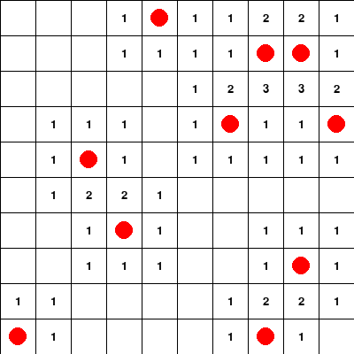

# Minesweeper Game

A simple implementation of the Minesweeper game using Python and Pygame.



## Installation

- Make sure you have Python 3 installed on your machine.
- Clone this repository

## How to Play

- The objective of the game is to reveal all safe cells without stepping on a mine.
- Left-click on a cell to reveal its content.
- Right-click on a cell to mark it as a potential mine.
- If you step on a mine, the game is over.
- If you reveal all safe cells, you win the game.


## Config
- Adjust the game settings (grid size and number of mines) by modifying the variables in settings.py:
    
    ```python
    GRID_SIZE = 10
    NUM_MINES = 10
    ```
  
## Dependencies
- Python3
- Pygame

